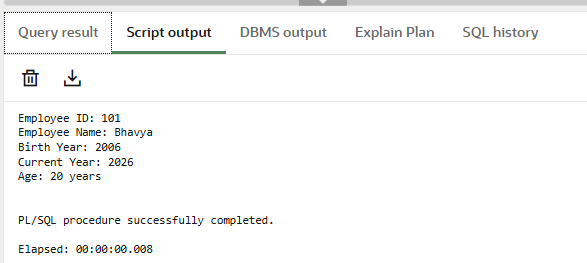

Student Name: Bhavya              			      UID: 24BAI70791  
Branch: CSE(AI & ML)	                     	      Section/Group: 24AIT_KRG-1/G2  
Semester: 4					                           Date of Performance: 13/01/2026  
Subject Name: Database Management System          Subject Code: 24CSH-298  

---

# Experiment – 3

## 1. Aim of the Session
To understand the basic structure of a PL/SQL program by creating and executing a simple PL/SQL block that includes Declaration and Execution sections and to display output using built-in procedures.

## 2. Software Requirements
-Database Management System: PostgreSQL  
-Database Administration Tool: pgAdmin  

## 3. Objectives
-To learn the structure of a PL/SQL block.  
-To use the DECLARE section for variable declaration.  
-To use the BEGIN…END block for execution.  
-To display output using DBMS_OUTPUT.PUT_LINE.  

## 4. Procedure of the Experiment
(i)Open pgAdmin and connect to the PostgreSQL database.  
(ii)Open the Query Tool.  
(iii)Write a PL/SQL program with:  
    -Declaration section  
    -Execution section  
(iv)Declare variables for employee details.  
(v)Display the variable values using output statements.  
(vi)Execute the program and observe the result.  

## 5. Practical / Experiment Steps
-Enable server output.  
-Declare variables emp_id, emp_name, and emp_salary.  
-Assign values to these variables.  
-Print the values using DBMS_OUTPUT.PUT_LINE.  
-End the PL/SQL block.  

## 6. Input / Output Details and Screenshot
Program (Input):

Output:

## 7. Learning Outcome
-Understood the basic structure of a PL/SQL block.  
-Learned how to declare and initialize variables.  
-Learned how to execute statements inside BEGIN…END block.  
-Learned how to display output using DBMS_OUTPUT.PUT_LINE.  
