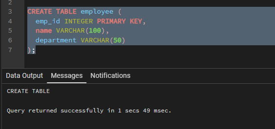
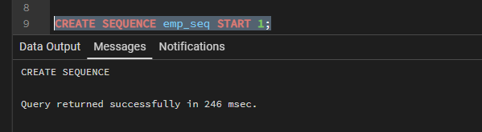
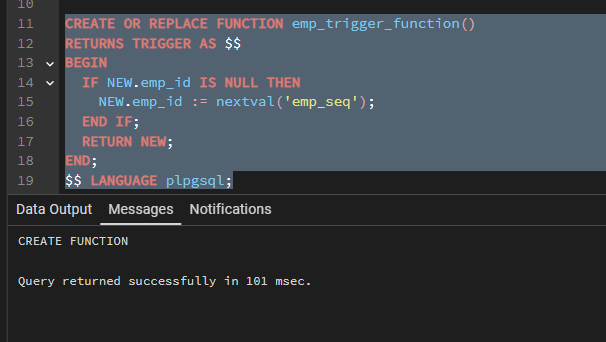
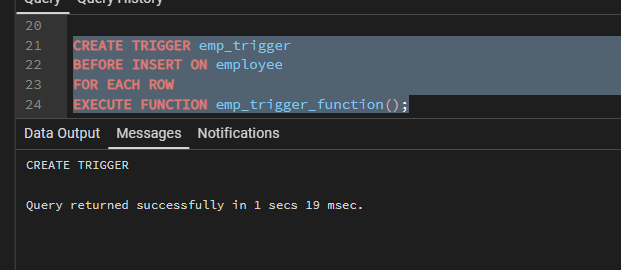
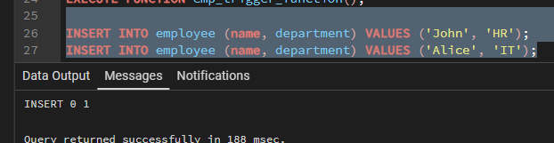
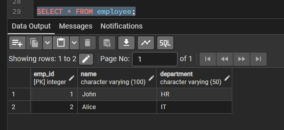

# Experiment 10 — Trigger-Based Automatic Primary Key Implementation (PL/SQL)

| Field | Details |
|---|---|
| **Student Name** | Bhavya |
| **UID** | 24BAI70791 |
| **Branch** | CSE (AI & ML) |
| **Section / Group** | 24AIT_KRG-1 / G2 |
| **Semester** | 4 |
| **Subject Name** | Database Management System |
| **Subject Code** | 24CSH-298 |

---

## Table of Contents

1. [Aim of the Session](#1-aim-of-the-session)
2. [Software Requirements](#2-software-requirements)
3. [Objectives](#3-objectives)
4. [Procedure of the Experiment](#4-procedure-of-the-experiment)
5. [Practical / Experiment Steps](#5-practical--experiment-steps)
6. [Input / Output Details and Screenshots](#6-input--output-details-and-screenshots)
7. [Learning Outcome](#7-learning-outcome)

---

## 1. Aim of the Session

To design a **trigger** that automatically implements the functionality of a primary key, ensuring unique identification of records without manual intervention.

---

## 2. Software Requirements

**Database Management System:**
- Oracle Database Express Edition (Oracle XE)
- PostgreSQL Database

**Database Administration Tool / Client Tool:**
- Oracle SQL Developer (for Oracle XE)
- pgAdmin (for PostgreSQL)

---

## 3. Objectives

To create a database trigger that automatically enforces **primary key constraints** or generates **unique key values**, replicating the functionality of a stored procedure.

---

## 4. Procedure of the Experiment

1. **Create the table** in the database with required fields and define a primary key column (or leave it for trigger-based assignment).
2. **Create a sequence** (or auto-increment logic) to generate unique values for the primary key.
3. **Design a trigger function** that runs before an INSERT operation.
4. Inside the trigger, **check if the primary key value is NULL** or not provided.
5. If NULL, **assign a unique value** using the sequence or counter logic.
6. **Create and attach the trigger** to the table for INSERT events.
7. **Insert sample records** without specifying the primary key value.
8. **Verify the output** by checking the table to ensure each record has a unique automatically generated primary key.

---

## 5. Practical / Experiment Steps

### Step 1 — Create Table

```sql
CREATE TABLE employee (
    emp_id     INTEGER PRIMARY KEY,
    name       VARCHAR(100),
    department VARCHAR(50)
);
```

### Step 2 — Create Sequence

```sql
CREATE SEQUENCE emp_seq START 1;
```

### Step 3 — Create Trigger Function

```sql
CREATE OR REPLACE FUNCTION emp_trigger_function()
RETURNS TRIGGER AS $$
BEGIN
    IF NEW.emp_id IS NULL THEN
        NEW.emp_id := nextval('emp_seq');
    END IF;
    RETURN NEW;
END;
$$ LANGUAGE plpgsql;
```

### Step 4 — Attach Trigger to Table

```sql
CREATE TRIGGER emp_trigger
BEFORE INSERT ON employee
FOR EACH ROW
EXECUTE FUNCTION emp_trigger_function();
```

### Step 5 — Insert Records & Verify

```sql
INSERT INTO employee (name, department) VALUES ('John',  'HR');
INSERT INTO employee (name, department) VALUES ('Alice', 'IT');

SELECT * FROM employee;
```

---

## 6. Input / Output Details and Screenshots

### Screenshot 1 — Table Creation

| Screenshot |
|:---:|
|  |

---

### Screenshot 2 — Sequence Creation

| Screenshot |
|:---:|
|  |

---

### Screenshot 3 — Trigger Function Creation

| Screenshot |
|:---:|
|  |

---

### Screenshot 4 — Trigger Attachment

| Screenshot |
|:---:|
|  |

---

### Screenshot 5 — Data Insertion

| Screenshot |
|:---:|
|  |

---

### Screenshot 6 — Final Output / SELECT Verification

| Screenshot |
|:---:|
|  |

---

## 7. Learning Outcome

- Understood the purpose and working of **database triggers**.
- Implemented **automated primary key functionality** using triggers and sequences.
- Ensured **data integrity** without manual key assignment.
- Applied **trigger-based automation** in real-world enterprise application scenarios such as Amazon, Flipkart, and Oracle.
