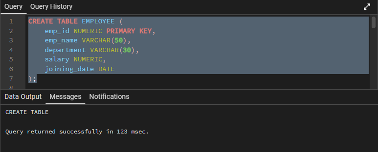
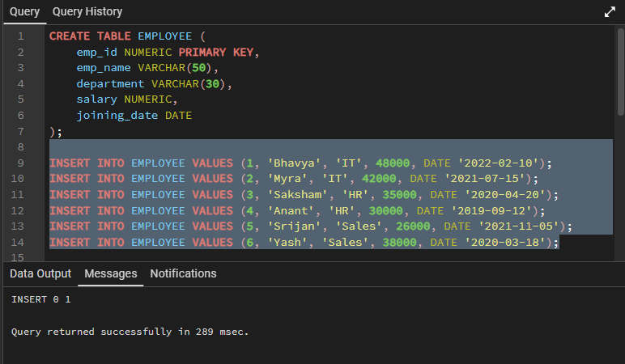
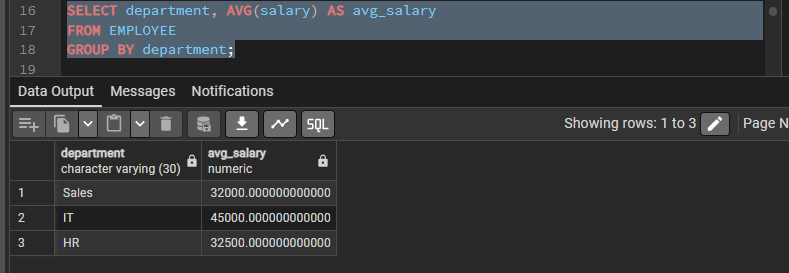
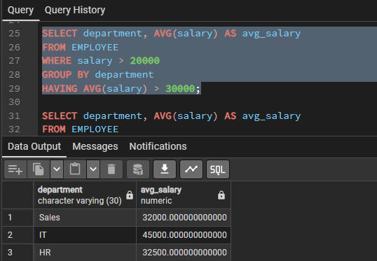
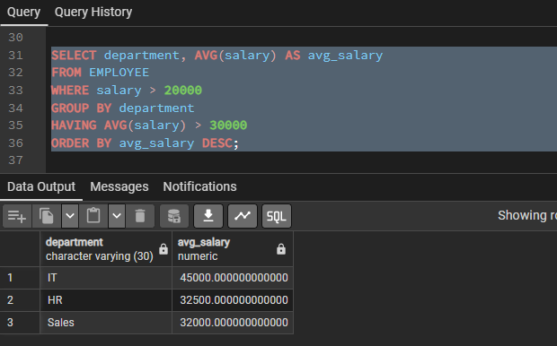

# Experiment 2: SQL SELECT Queries with WHERE, GROUP BY, HAVING, and ORDER BY

Student Name: Bhavya  
UID: 24BAI70791  
Branch: CSE(AI & ML)  
Section/Group: 24AIT_KRG-1/G2  
Semester: 4  
Date of Performance: 13/01/2026  
Subject Name: Database Management System  
Subject Code: 24CSH-298  

---

## Aim of the Session
To understand and implement SQL SELECT queries using clauses such as WHERE, GROUP BY, HAVING, and ORDER BY for retrieving and analyzing employee data from a relational database table.

---

## Software Requirements
PostgreSQL Database (pgAdmin)  
MS Word / PDF editor  

---

## Objectives
To practice writing SQL SELECT queries.  
To apply filtering conditions using the WHERE clause.  
To group records using the GROUP BY clause.  
To filter grouped data using the HAVING clause.  
To sort query results using the ORDER BY clause.  
To use aggregate functions such as AVG() for data analysis.  

---

## Procedure of the Experiment
Start the system and log in to the database.  
Create the EMPLOYEE table using SQL commands.  
Insert employee records into the table.  
Execute SELECT queries using GROUP BY, WHERE, HAVING, and ORDER BY clauses.  
Verify the output after execution.  
Save the work and take screenshots for record.  

---

## SQL Code

```sql
CREATE TABLE EMPLOYEE (
    emp_id NUMERIC PRIMARY KEY,
    emp_name VARCHAR(50),
    department VARCHAR(30),
    salary NUMERIC,
    joining_date DATE
);

INSERT INTO EMPLOYEE VALUES (1, 'Bhavya', 'IT', 48000, DATE '2022-02-10');
INSERT INTO EMPLOYEE VALUES (2, 'Myra', 'IT', 42000, DATE '2021-07-15');
INSERT INTO EMPLOYEE VALUES (3, 'Saksham', 'HR', 35000, DATE '2020-04-20');
INSERT INTO EMPLOYEE VALUES (4, 'Anant', 'HR', 30000, DATE '2019-09-12');
INSERT INTO EMPLOYEE VALUES (5, 'Srijan', 'Sales', 26000, DATE '2021-11-05');
INSERT INTO EMPLOYEE VALUES (6, 'Yash', 'Sales', 38000, DATE '2020-03-18');

SELECT department, AVG(salary) AS avg_salary
FROM EMPLOYEE
GROUP BY department;

SELECT department, AVG(salary) AS avg_salary
FROM EMPLOYEE
WHERE salary > 20000
GROUP BY department;

SELECT department, AVG(salary) AS avg_salary
FROM EMPLOYEE
WHERE salary > 20000
GROUP BY department
HAVING AVG(salary) > 30000;

SELECT department, AVG(salary) AS avg_salary
FROM EMPLOYEE
WHERE salary > 20000
GROUP BY department
HAVING AVG(salary) > 30000
ORDER BY avg_salary DESC;

## Input Table

| Employee ID | Employee Name | Department | Salary | Joining Date |
|-------------|---------------|------------|--------|--------------|
| 1 | Bhavya | IT | 48000 | 2022-02-10 |
| 2 | Myra | IT | 42000 | 2021-07-15 |
| 3 | Saksham | HR | 35000 | 2020-04-20 |
| 4 | Anant | HR | 30000 | 2019-09-12 |
| 5 | Srijan | Sales | 26000 | 2021-11-05 |
| 6 | Yash | Sales | 38000 | 2020-03-18 |

---

## Output and Learning Outcome

Displays department-wise average salary.  
Filters employees with salary greater than 20000.  
Displays only those departments whose average salary is greater than 30000.  
Output is sorted in descending order of average salary.  

After completing this experiment, students will be able to:  
Filter records using the WHERE clause.  
Group records using the GROUP BY clause.  
Apply conditions on grouped data using the HAVING clause.  
Sort query results using the ORDER BY clause.  
Use aggregate functions like AVG() for data analysis.  

---

## Screenshots

  
  

  
 
 

---

End of Experiment 2
