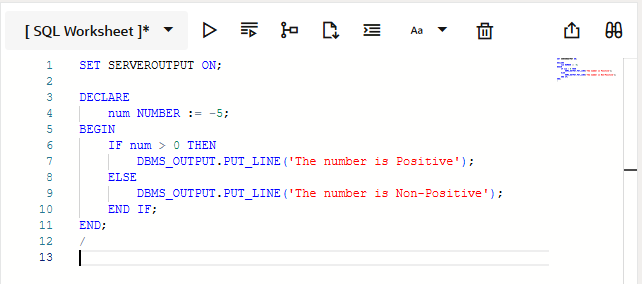
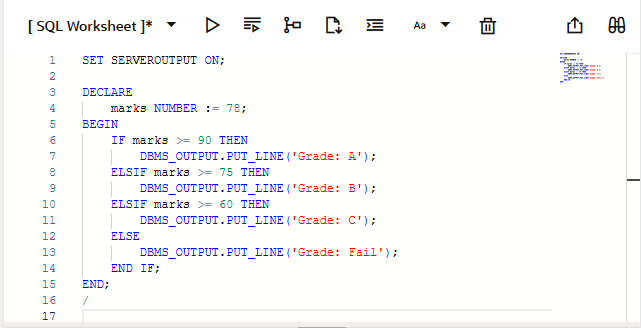
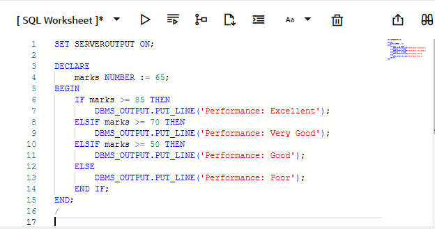
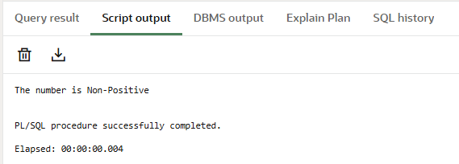
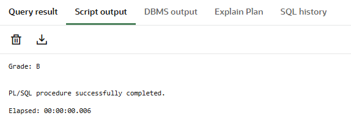

# Experiment – 4: PL/SQL Conditional Control Statements

**Student Name:** Bhavya  
**UID:** 24BAI70791  
**Branch:** CSE(AI & ML)  
**Section/Group:** 24AIT_KRG-1/G2  
**Semester:** 4  
**Subject Name:** Database Management System  
**Subject Code:** 24CSH-298  

---

## 1. Aim of the Session
To design and implement PL/SQL programs utilizing conditional control statements such as IF–ELSE, ELSIF, ELSIF ladder, and CASE constructs in order to control the flow of execution based on logical conditions and to analyze decision-making capabilities in PL/SQL blocks.

---

## 2. Software Requirements
- Database Management System: Oracle Database  
- Database Administration Tool: Oracle SQL Developer  

---

## 3. Objectives
- To understand conditional control statements in PL/SQL.  
- To implement IF–ELSE statements in PL/SQL blocks.  
- To implement IF–ELSIF–ELSE ladder.  
- To use CASE statements for decision making.  
- To analyze program execution based on conditions.  

---

## 4. Procedure of the Experiment
1. Open Oracle SQL Developer and connect to the Oracle database.  
2. Open a new SQL Worksheet.  
3. Enable server output using `SET SERVEROUTPUT ON;`.  
4. Write the required PL/SQL block using conditional control statements.  
5. Execute the program and observe the output in the output window.  
6. Modify input values to verify different conditions.  

---

## 5. Practical / Experiment Steps
1. Enable server output: `SET SERVEROUTPUT ON;`.  
2. Declare the required variables such as `num`, `marks`, and `day_no`.  
3. Assign values to the variables.  
4. Use IF–ELSE statement to check whether a number is positive or non-positive.  
5. Use IF–ELSIF–ELSE ladder to evaluate the grade of a student based on marks.  
6. Use ELSIF ladder to determine the performance status of a student based on marks.  
7. Use CASE statement to display the name of the day based on a given day number.  
8. Display the output using `DBMS_OUTPUT.PUT_LINE`.  
9. End the PL/SQL block using `END;` and execute with `/`.  

---

## 6. Input / Output Details and Screenshot

Program (Input):
Program 1: IF–ELSE Statement

Program 2: IF–ELSIF–ELSE Statement

Program 3: ELSIF Ladder

Program 4: CASE Statement 

Output:
Program 1: IF–ELSE Statement

Program 2: IF–ELSIF–ELSE Statement

Program 3: ELSIF Ladder

Program 4: CASE Statement 

---

## 7. Learning Outcome
- Learned how to use IF–ELSE, ELSIF ladder, and CASE statements in PL/SQL.  
- Understood decision-making using conditional control structures.  
- Gained practical knowledge of writing PL/SQL blocks.  
- Improved understanding of logical flow control in database programming.
