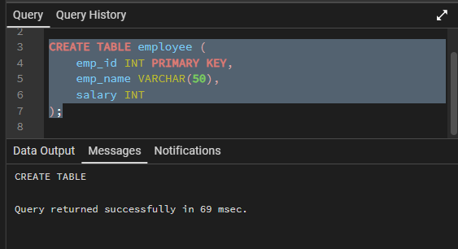
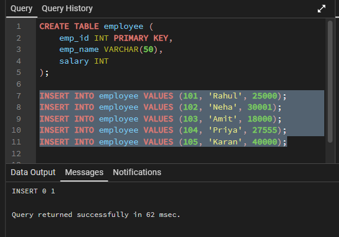
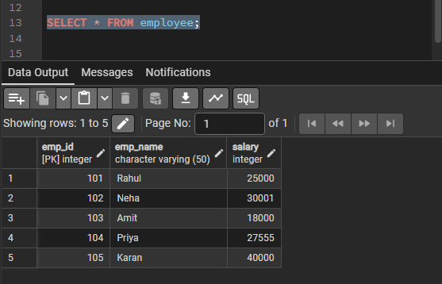
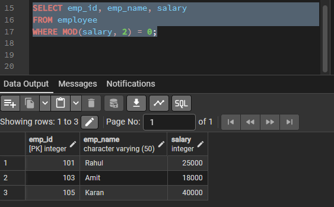
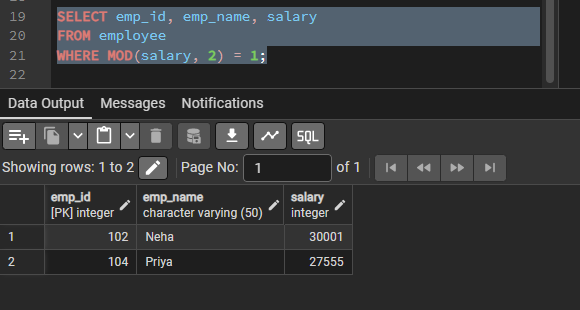
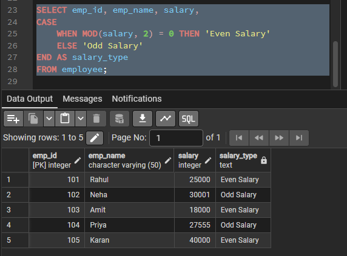

# Experiment – 5

**Student Name:** Bhavya  
**UID:** 24BAI70791  
**Branch:** CSE(AI & ML)  
**Section/Group:** 24AIT_KRG-1/G2  
**Semester:** 4   
**Subject Name:** Database Management System  
**Subject Code:** 24CSH-298  

---

## 1. Aim of the Session
To understand and apply conditional logic in SQL by using the modulus operator (MOD / %) to analyze numerical data and classify employee salaries as odd or even, thereby improving data analysis and decision-making skills in SQL.

---

## 2. Software Requirements
- Database Management System: Oracle Database  
- Database Administration Tool: Oracle SQL Developer  

---

## 3. Objectives
- To write and execute SQL queries that use the MOD (%) operator to check employee
salaries and display odd and even salary values separately from an employee table.

---

## 4. Procedure of the Experiment
- 1. Create an employee table with fields emp_id, emp_name, and salary.

- 2. Insert sample employee data into the table using the INSERT command.

- 3. Display all records from the employee table using the SELECT statement.

- 4. Use the MOD (%) operator to check and separate even and odd salary values.

- 5. Use the CASE statement to label each salary as “Even” or “Odd” and observe the output.

---

## 5. Input / Output Details and Screenshot

 

---

## 6. Learning Outcome
- Understand the use of the MOD (%) operator in SQL.

- Apply conditional logic to classify numerical data as odd or even.

- Write and execute SELECT queries with conditions using the WHERE clause.

- Use the CASE statement to generate meaningful labels in query results.

- Improve skills in data analysis and decision-making using SQL queries.

