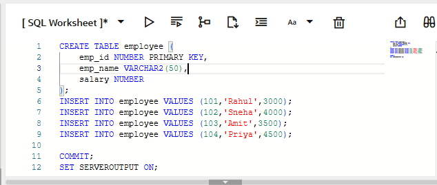
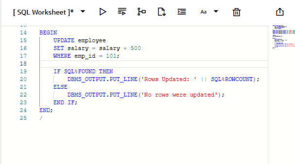
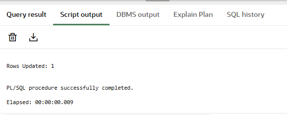
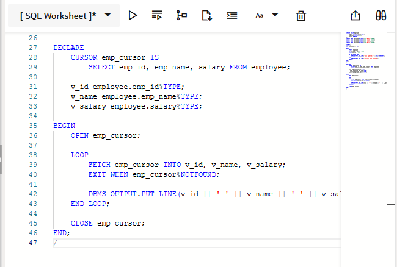
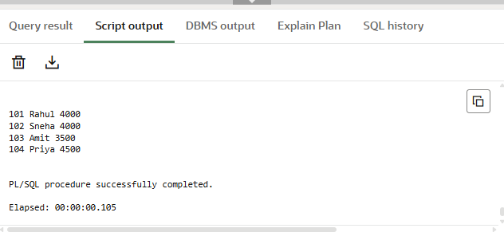
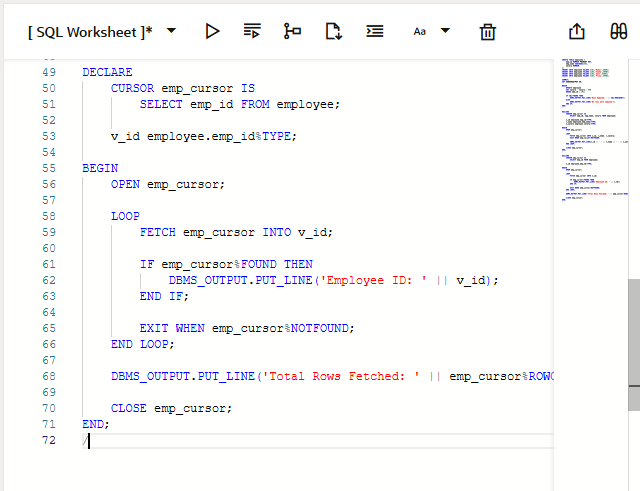
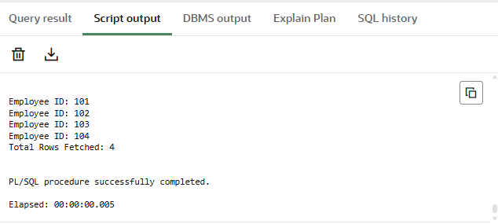

# Experiment – 6

**Student Name:** Bhavya  
**UID:** 24BAI70791  
**Branch:** CSE(AI & ML)  
**Section/Group:** 24AIT_KRG-1/G2  
**Semester:** 4   
**Subject Name:** Database Management System  
**Subject Code:** 24CSH-298  

---

## 1. Aim of the Session
To understand the concept and working of cursors in PL/SQL for row-by-row data processing, and to analyze how implicit cursors, explicit cursors, and cursor attributes are used to implement business logic on multiple rows in a database table.

---

## 2. Software Requirements
- Database Management System: Oracle Database  
- Database Administration Tool: Oracle SQL Developer  

---

## 3. Objectives
- To implement and analyze the use of implicit cursors, explicit cursors, and cursor attributes for processing multiple rows from a database table and applying business logic effectively.

---

## 4. Procedure of the Experiment
- 1. Create an employee table with fields EmpID, EmpName, and Salary.
- 2. Insert sample employee records into the table using the INSERT command.      
- 3. Display all employee records from the table using the SELECT statement.
- 4. Write a PL/SQL block using an implicit cursor to perform operations such as UPDATE or DELETE on the employee table.
- 5. Use the SQL%ROWCOUNT cursor attribute to check how many rows were affected by the operation.
- 6. Declare an explicit cursor to retrieve employee records from the table.
- 7. Open the cursor using the OPEN statement to begin processing the records.
- 8. Fetch records one by one from the cursor using the FETCH statement.
- 9. Use a LOOP structure to process each employee record individually.
- 10. Apply cursor attributes such as %FOUND, %NOTFOUND, %ROWCOUNT, and %ISOPEN to control the program flow.
- 11. Display the processed employee details using DBMS_OUTPUT.PUT_LINE.
- 12. Close the cursor using the CLOSE statement after all records are processed.
- 13. Execute the program and observe the output.

---

## 5. Practical / Experiment Steps
Create PL/SQL programs to:
- Fetch employee records from a database table using cursors
- Process each record individually
- Display results or apply business logic using cursor attributes

---

## 6. Input / Output Details and Screenshot

 

---

## 7. Learning Outcome
After completing this experiment, we learned:
- The concept and importance of cursors in PL/SQL
- The difference between implicit and explicit cursors
- How to use cursor attributes such as %FOUND, %NOTFOUND, %ROWCOUNT, and %ISOPEN
- How to process database records row by row
- Practical implementation of cursors in database programs

