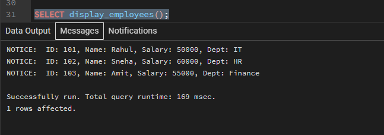
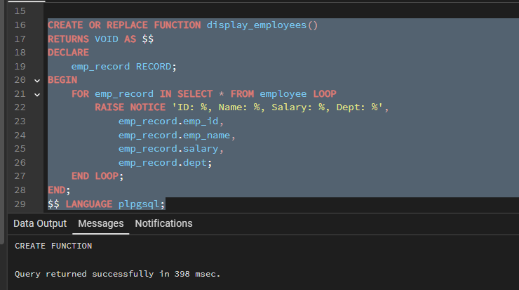
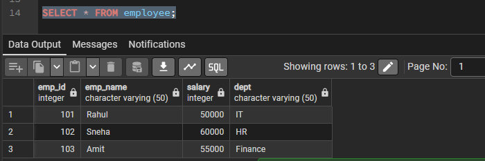
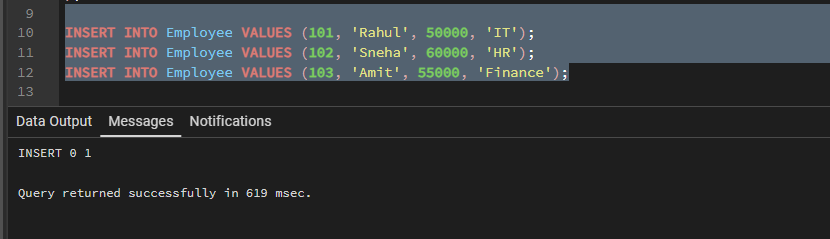
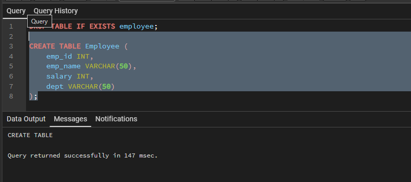

# Experiment 9 — PL/SQL Packages with Procedures and Shared Cursors

| Field | Details |
|---|---|
| **Student Name** | Bhavya |
| **UID** | 24BAI70791 |
| **Branch** | CSE (AI & ML) |
| **Section / Group** | 24AIT_KRG-1 / G2 |
| **Semester** | 4 |
| **Subject Name** | Database Management System |
| **Subject Code** | 24CSH-298 |

---

## Table of Contents

1. [Aim of the Session](#1-aim-of-the-session)
2. [Software Requirements](#2-software-requirements)
3. [Objectives](#3-objectives)
4. [Procedure of the Experiment](#4-procedure-of-the-experiment)
5. [Practical / Experiment Steps](#5-practical--experiment-steps)
6. [Input / Output Details and Screenshots](#6-input--output-details-and-screenshots)
7. [Learning Outcome](#7-learning-outcome)

---

## 1. Aim of the Session

To create and implement **PL/SQL packages** by developing a package specification and package body containing procedures and shared cursors, in order to achieve modular, reusable, and efficient database programming.

---

## 2. Software Requirements

**Database Management System:**
- Oracle Database Express Edition (Oracle XE)
- PostgreSQL Database

**Database Administration Tool / Client Tool:**
- Oracle SQL Developer (for Oracle XE)
- pgAdmin (for PostgreSQL)

---

## 3. Objectives

To design and implement a PL/SQL package that includes **procedures** and **shared cursors** for structured and modular program development.

---

## 4. Procedure of the Experiment

1. Create an `Employee` table to store employee details like ID, name, salary, and department.
2. Insert sample records into the table to test the package functionality.
3. Create the **package specification** to declare procedures that will be used externally.
4. Create the **package body** to define the actual implementation of the declared procedures.
5. Declare a **shared cursor** inside the package to retrieve employee records efficiently.
6. Implement the procedure to open the cursor, fetch records, and display them.
7. Compile the package to check and remove any syntax errors.
8. Execute the package procedure using a PL/SQL block.
9. Verify the output by displaying employee details using `DBMS_OUTPUT`.

---

## 5. Practical / Experiment Steps

### Step 1 — Create Employee Table

```sql
CREATE TABLE Employee (
    emp_id    NUMBER,
    emp_name  VARCHAR2(50),
    salary    NUMBER,
    dept      VARCHAR2(50)
);
```

### Step 2 — Insert Sample Data

```sql
INSERT INTO Employee VALUES (101, 'Rahul', 50000, 'IT');
INSERT INTO Employee VALUES (102, 'Sneha', 60000, 'HR');
INSERT INTO Employee VALUES (103, 'Amit',  55000, 'Finance');
```

### Step 3 — Package Specification

```sql
CREATE OR REPLACE PACKAGE emp_pkg AS
    PROCEDURE display_employees;
END emp_pkg;
/
```

### Step 4 — Package Body

```sql
CREATE OR REPLACE PACKAGE BODY emp_pkg AS

    CURSOR emp_cursor IS
        SELECT * FROM Employee;

    PROCEDURE display_employees IS
        emp_record emp_cursor%ROWTYPE;
    BEGIN
        OPEN emp_cursor;
        LOOP
            FETCH emp_cursor INTO emp_record;
            EXIT WHEN emp_cursor%NOTFOUND;
            DBMS_OUTPUT.PUT_LINE(
                'ID: '     || emp_record.emp_id   ||
                ' Name: '  || emp_record.emp_name ||
                ' Salary: '|| emp_record.salary   ||
                ' Dept: '  || emp_record.dept
            );
        END LOOP;
        CLOSE emp_cursor;
    END;

END emp_pkg;
/
```

### Step 5 — Execute Package

```sql
BEGIN
    emp_pkg.display_employees;
END;
/
```

---

## 6. Input / Output Details and Screenshots

### Screenshot 1 — Table Creation

| Screenshot |
|:---:|
|  |

---

### Screenshot 2 — Data Insertion & SELECT Verification

| Screenshot |
|:---:|
|  |

---

### Screenshot 3 — Package / Function Creation

| Screenshot |
|:---:|
|  |

---

### Screenshot 4 — Procedure Execution & Output

| Screenshot |
|:---:|
|  |

---

### Screenshot 5 — Final Output / Verification

| Screenshot |
|:---:|
|  |

---

## 7. Learning Outcome

- Understood the concept and structure of **PL/SQL packages**.
- Differentiated between **package specification** and **package body**.
- Developed procedures to perform database operations within a package.
- Used **cursors** to retrieve and process records efficiently.
- Written **modular and reusable** PL/SQL code for real-world scenarios.
